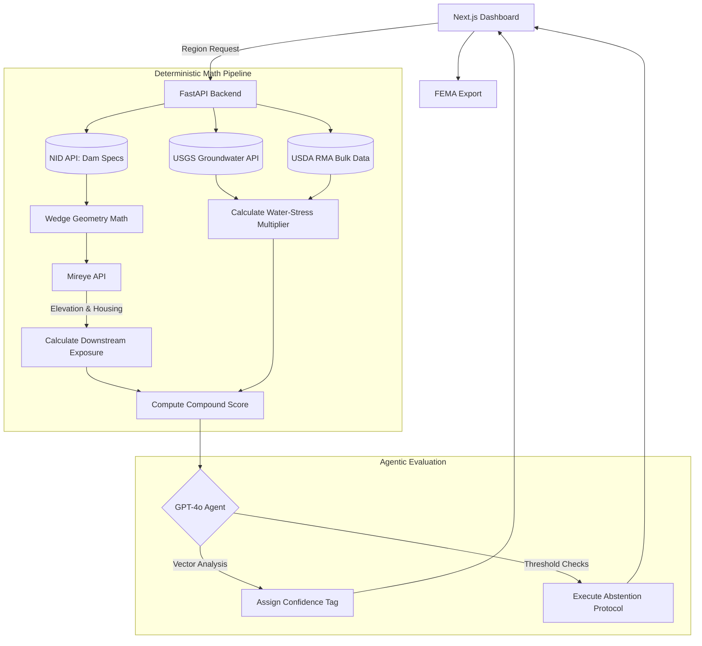

# Hydro-Sentinel: Technical Architecture & Proposal

## 1. The Problem

### 1.1 The Human and Economic Cost
There are over 2,300 "High Hazard" dams in the US rated in "Poor" or "Unsatisfactory" condition. "High Hazard" structurally guarantees probable loss of human life upon failure. Beyond immediate casualty risks, failure destroys downstream agricultural infrastructure. Flooding an area already suffering from severe, multi-year drought compounds the economic devastation, as the depleted water table cannot sustain recovery.

### 1.2 Current Solutions and Gaps
State dam-safety offices must rank their failing dams to secure FEMA High Hazard Potential Dam (HHPD) rehabilitation grants. They currently rely on:
*   **High-End:** Quantitative Risk Assessments (QRA) requiring full hydrological routing (HEC-RAS). Highly accurate but unscalable at **$10,000–$100,000+ per dam**.
*   **Low-End:** Heuristic Excel matrices relying on subjective, manual Google Earth estimates of downstream exposure and static National Inventory of Dams (NID) ratings.
*   **The Gap:** There is no mathematically defensible, automated triage layer that operates between a manual spreadsheet and a full QRA, nor do any existing models factor in surrounding economic/environmental resilience.

### 1.3 Our Solution and USP
**Hydro-Sentinel** is an automated, agentic screening-level triage engine. 
*   **Solution:** It fuses site-specific topographic exposure (Mireye) with continuous, percentile-ranked agricultural stress data (USDA/USGS) to produce a Compound Risk Score.
*   **USP:** An LLM agent acts as a safeguard over the deterministic pipeline, evaluating evidence sufficiency (data freshness, spatial coverage) and explicitly **abstaining** from ranking when data is too thin, ensuring institutional trust at an operational cost of ~$0.06 per dam.

---

## 2. Idea and Implementation

### 2.1 Solution: The Deterministic Pipeline vs. Agentic Intelligence
Hydro-Sentinel enforces a strict boundary between mathematical data fusion and agentic reasoning.

**A. The Deterministic Pipeline (Mathematics)**
Instead of complex GIS flow routing, we approximate inundation via a **90° Directional Wedge**.
1.  **Downstream Exposure:** We fetch `aspect_degrees` (flow direction) and `crest_elevation` ($h_c$) at the dam coordinate. We sample $k$ points (e.g., $r \in \{1, 2, 3, 5\}$ km) within the downhill wedge. We fetch `elevation` ($e_i$) and `housing_units_within_1km` ($h_i$) at each point.
    $$\text{DSC}(d) = \sum_{i=1}^{k} \mathbb{1}[e_i < h_c] \cdot h_i \cdot \frac{1/r_i}{\sum_j 1/r_j}$$
    *(Distance-Weighted Downstream Structure Count, mathematically filtered to exclude terrain above the dam).*
2.  **Water-Stress Multiplier:** We percentile-rank the county's USGS groundwater decline rate ($\Phi_U$) and USDA drought indemnity ($\Phi_R$). We use maximum-entropy equal weighting to avoid arbitrary bonuses:
    $$\text{Multiplier}(d) = 1.0 + 0.5 \cdot \Phi_U + 0.5 \cdot \Phi_R \quad \in [1.0, 2.0]$$
3.  **Compound Score:** $\text{DSC} \times S(d) \times \text{Multiplier}$, where $S(d)$ is a scalar derived from NID condition.

**B. The Agentic Layer (Non-Hardcoded Reasoning)**
An LLM agent processes the resulting **Evidence Vector**: `[NID_age, USGS_proximity, sample_coverage, signal_agreement]`.
*   **Evidence Sufficiency & Abstention:** A static pipeline will calculate a score even if the nearest USGS station is 60km away and the NID rating is 8 years old. The Agent evaluates the vector holistically and will output `INSUFFICIENT EVIDENCE`, refusing to rank the dam.
*   **Confidence Tagging & Escalation:** The agent classifies the priority (`ESCALATE`, `ROUTINE`) and assigns confidence (`HIGH`, `MEDIUM`, `LOW`), providing a trace explanation of which signals drove the decision.

### 2.2 User Flow Journey
1.  **Intent:** Engineer inputs state region.
2.  **Orchestration:** Backend queries NID API for High Hazard/Poor condition case universe.
3.  **Batch Retrieval:** System quotes and fetches Mireye terrain/housing batches, plus USGS/USDA data.
4.  **Compute:** Pipeline computes DSC and Compound Scores.
5.  **Agent Evaluation:** LLM evaluates evidence sufficiency per dam.
6.  **Product UI:** Renders a ranked, sortable list with Agent Confidence tags.
7.  **Export:** User exports CSV and traced Evidence PDF for FEMA grant application.

### 2.3 Core Capabilities
*   **API-Driven Spatial Analysis:** Eliminates the need for hosted DEMs (Digital Elevation Models) or Census shapefile intersections.
*   **Multi-Domain Fusion:** Unifies structural, topographic, demographic, agricultural, and hydrological data.
*   **Self-Aware Abstention:** The agent prevents "fake precision" by failing safely on thin data.

### 2.4 Tech Stack
*   **Backend / Data:** Python (FastAPI), Pandas/NumPy (vectorized math, percentile ranks), GeoPy (wedge geometries), SQLite.
*   **Agent Intelligence:** OpenAI API (GPT-4o) via strict function calling to ensure structured JSON output.
*   **Frontend:** Next.js (React) for an interactive, dashboard-driven investigation UI.

### 2.5 Arch Diagram

### 2.6 Target Users, "Who writes the cheque?"
*   **Users:** State Dam Safety Engineers (triage execution) and FEMA Regional Directors (grant review).
*   **Purchaser:** State Departments of Water Resources / Emergency Management Agencies (software procurement).

---

## 3. Mireye Integration

### 3.1 Impact and System Level Value
Mireye serves as the fundamental engine for the spatial analysis. Calculating Downstream Exposure historically requires loading gigabytes of 3DEP LIDAR data and intersecting it with Census block polygons in ArcGIS. 
Mireye allows the backend to perform sub-second queries for `elevation`, `slope_degrees`, `aspect_degrees`, and `housing_units_within_1km` at mathematically defined arbitrary coordinates. This enables the programmatic generation of the Downstream Structure Count (DSC) entirely via REST API, completely decoupling the platform from heavy GIS infrastructure.

### 3.2 Why is Mireye Super Necessary (Ablation Study)
To prove necessity, we run a **Baseline Ablation**:
1.  **Baseline Model (No Mireye):** Dams are ranked solely by their NID Hazard and Condition labels. *Result:* Massive ties. Dozens of dams in the same state receive the exact same priority.
2.  **Compound Score Model (With Mireye):** The DSC introduces site-specific topographic and demographic reality. 
*Conclusion:* Without Mireye, the system cannot differentiate between a failing dam above a canyon with zero population, and a failing dam directly above a suburb. Mireye is the exclusive provider of the spatial differentiation required to break the ties in the NID baseline.

### 3.3 Two Week Implementation Road Map
*   **Week 1: Pipeline Engineering**
    *   *Day 1-2:* Configure backend architecture; establish NID API and RMA bulk parsing.
    *   *Day 3-5:* Implement Mireye batch client; code the GeoPy directional wedge and DSC mathematical filtering.
    *   *Day 6-7:* Implement continuous percentile multiplier (USGS/RMA) and final Compound Score logic.
*   **Week 2: Agent Integration & Product**
    *   *Day 8-9:* Integrate LLM function-calling for the Evidence Sufficiency and Abstention protocol.
    *   *Day 10-12:* Develop Next.js UI (Dashboard, Ranked List, Evidence Drill-Downs).
    *   *Day 13-14:* Run system evaluations against historical FEMA HHPD awards; prepare demo trace.

---

## 4. Finance and Legality

### 4.1 Cost Savings
*   **Consultant QRA:** ~$10,000+ per dam.
*   **Hydro-Sentinel API Cost:** ~11 credits per coordinate × 9 samples = ~99 credits per dam. At bulk pricing, this operates at **~$0.06 per dam**. 
The software functions as an extreme-efficiency triage layer, ensuring the state only allocates the $10,000 QRA engineering budgets to the top 5% of structures that actually warrant it.

### 4.2 Legal Compliance
*   **Data Rights:** Operates exclusively on public-domain US government datasets (USACE, USDA, USGS) and legally compliant commercial APIs (Mireye).
*   **Liability Firewalls:** System is explicitly classified as a budgetary screening and prioritization proxy, not a life-safety Emergency Action Plan (EAP). It triggers financial workflows, not emergency evacuations.

### 4.3 Partnerships and Future Expansion
*   **Pilot Targets:** Association of State Dam Safety Officials (ASDSO) for deployment in high-drought states (e.g., CA, TX).
*   **Expansion Phase:** Integrate dynamic NOAA precipitation APIs to temporarily spike priority scores for dams entering forecasted atmospheric river paths.

